# Module 11 Challenge: Forecasting Net Prophet

## Background

In this scenario, you’re a growth analyst at [Mercado Libre](http://investor.mercadolibre.com/investor-relations). With over 200 million users, Mercado Libre is the most popular e-commerce site in Latin America. You've been tasked with analysing the company's financial and user data in clever ways to help the company grow.

In a bid to drive revenue, you’ll produce a Jupyter notebook that contains your data preparation, your analysis, and your visualisations for all the time series data that the company needs to understand. You’ll use text and comments to document your findings. And, you’ll answer the question prompts in the instructions. Specifically, this notebook should contain the following:

* Visual depictions of seasonality (as measured by Google Search traffic) that are of interest to the company.

* An evaluation of how the company stock price correlates to its Google Search traffic.

* A Prophet forecast model that can predict hourly user search traffic.

* Answers to the questions in the instructions that you write in your Jupyter notebook.

* (Optional) A plot of a forecast for the company’s future revenue.

When you finish, you’ll push your final notebook to your GitHub repository so that others can review your work.

You’ll gain proficiency in the following tasks:

* Identifying patterns in time series data.

* Mining for patterns in seasonality by using visualisations.

* Building sales-forecast and user-interest predictive models.

---

## Summary of Models and Findings

### Unusual Patterns in Hourly Google Search Traffic

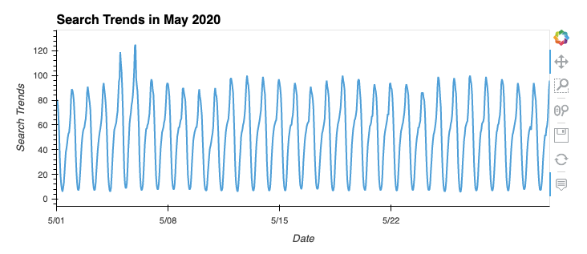

From slicing data to just the month of May 2020, We found that here was an increase in Google search traffic during the month of May 2020 when MercadoLibre released its financial results. 
The total search traffic for the month was 38,181, which was higher than the median search traffic of 35,172.5

### Seasonality of Search Traffic Data

From the line graph we can see that Monday had the highest average in Search Traffic. 

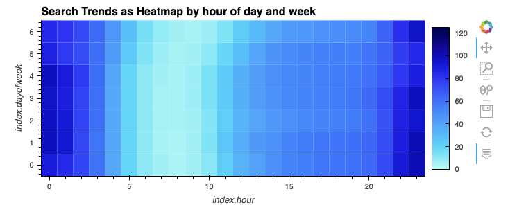

The heatmap reveals a surge in search traffic during the early and late hours of the day, this may be due to people checking their phones in the morning and before bed. There's a lull in traffic between 6 a.m to 10 a.m., most likely because people are occupied with work or school. Search activity begins strongly at the start of the week and gradually decreases as the week progresses.

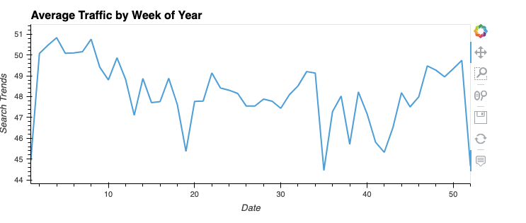

Search traffic rises during the winter months (weeks 40 to 52) but significantly drops after the holiday season

### Search Traffic to Stock Price Patterns

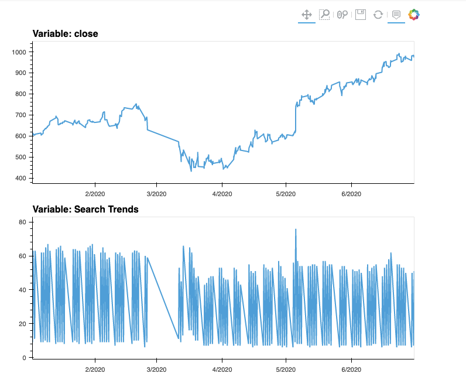

The graphs indicate a downward trend in both stock price and search traffic from February to March 2020. When the stock price rises in May 2020, there is a noticeable peak in search traffic. In general, a rise in stock price leads to increased volatility in search traffic.

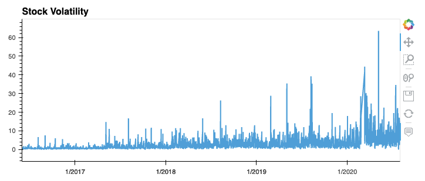
Volatility spiked and tended to stay high, during the first half of 2020. This is a common characteristic of volatility in stock returns worldwide: high volatility days tend to be followed by yet more high volatility days. When it rains, it pours.

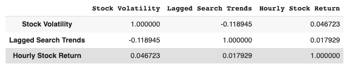

The correlation table indicates that the relationship between Lagged Search Trends and Stock Volatility is weakly negative (-0.118945). This means that as one of the variables increases, the other decreases, but not by a strong amount.

Also, the relationship between Lagged Search Trends and Hourly Stock Return is weakly positive (0.017929), meaning that as one of the variables increases, the other also increases but again, not by a strong amount.

So, it can be concluded that the relationship between Lagged Search Trends and both Stock Volatility and Hourly Stock Return is not strong, and therefore the lagged search traffic may not have a predictable impact on the stock volatility or stock price returns.

### Time Series Model with Prophet

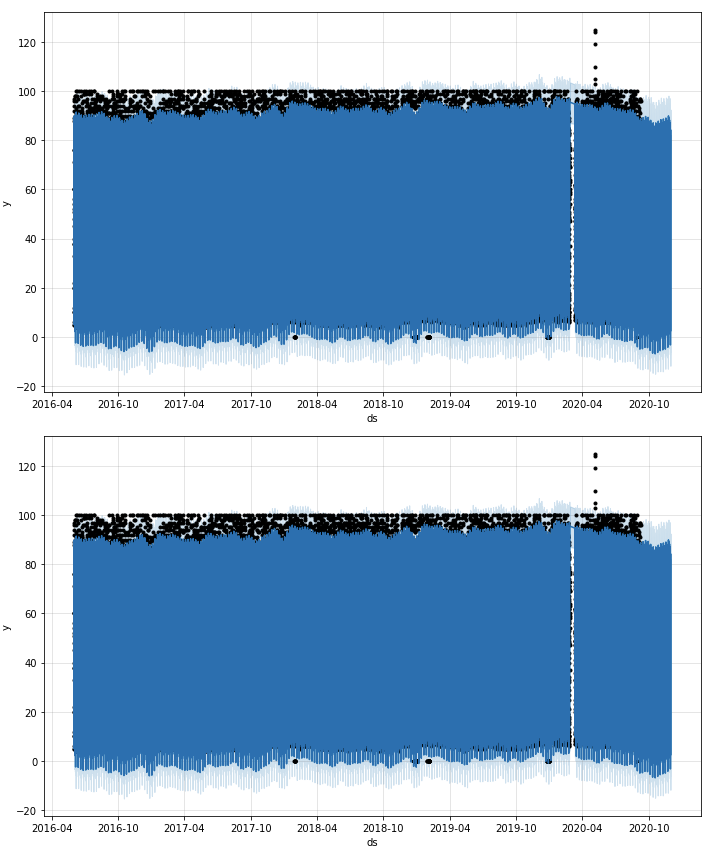

The forecast seems to indicate that the popularity gradually decreases towards the end of 2020.

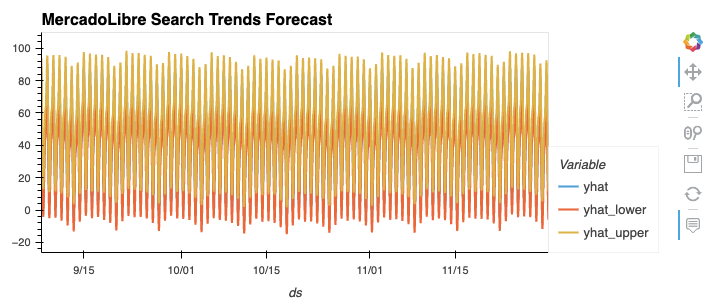

yhat represents the most likely (average) forecast, whereas yhat_lower and yhat_upper represents the worst and best case prediction (based on what are known as 95% confidence intervals).

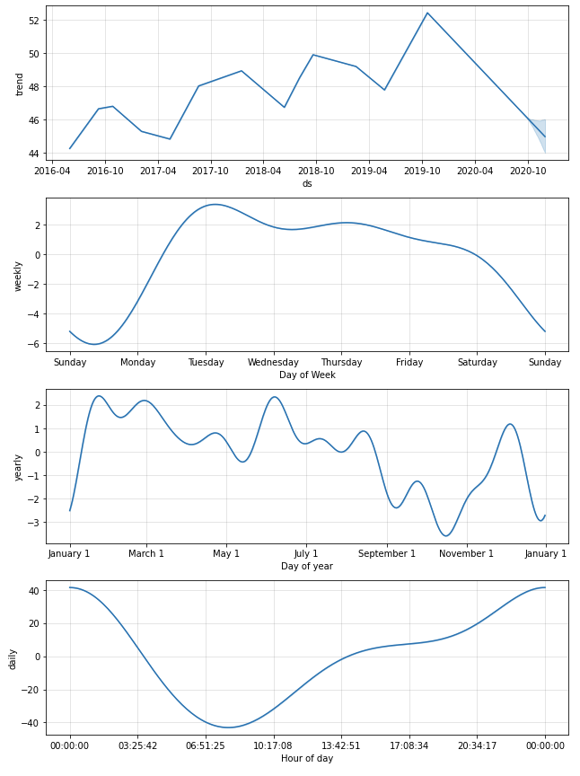

Midnight - 00:00AM is the time of day that exhibits the greatest popularity

Monday and Tuesday gets the most search traffic

Towards the end of October is the lowest point for search traffic in the calendar year

### Forecast Revenue by Using Time Series Models

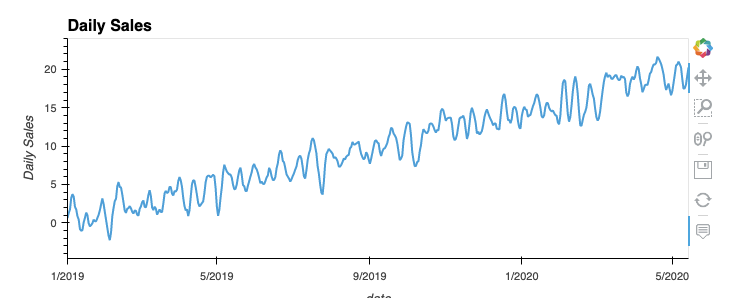

Graph showing daily sales from existing data.

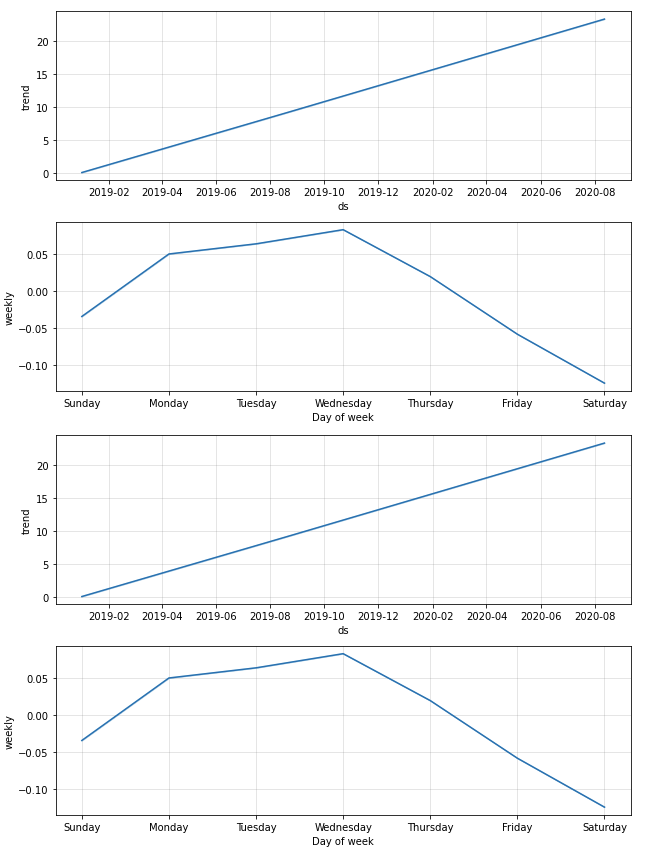

Upward trend starts Sunday to Monday, hitting the peak on Wednesday

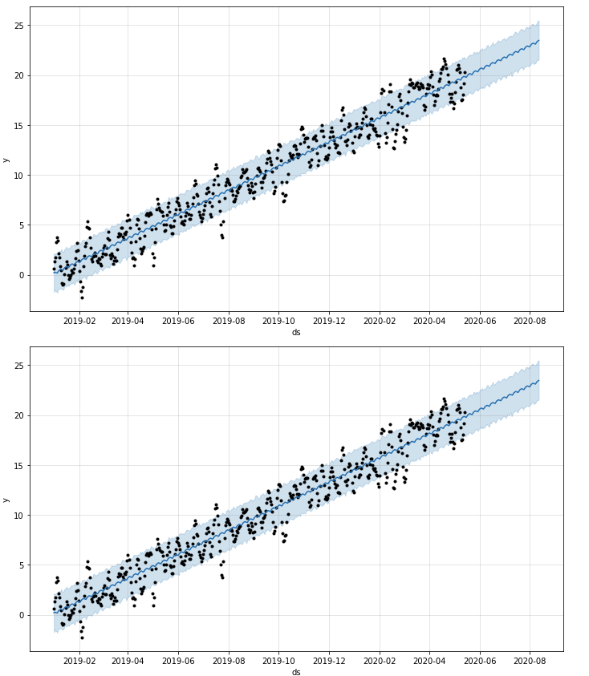

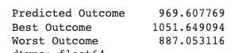

 The expected total sales for the finance division next quarter is predicted to be around $$969.60 million. The best case scenario is expected to be around $1.05 billion, while the worst case scenario is expected to be around $887.05 million.

---

